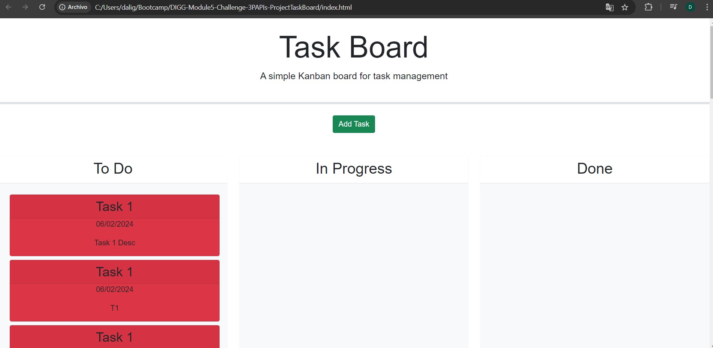

# DIGG-Module5-Challenge-3PAPIs-ProjectTaskBoard
Dalia Gomez - Module 5 Challenge: 3P APIs, Project Task Board.

## Description
The purpose of this challenge was to create a task board application that allows a team to manage project tasks, classifying them in: "to do", "in progress" and "done". The "DIGG-Module5-Challenge-3PAPIs-ProjectTaskBoard" repository includes one CSS file (style.css), one HTML file (index.html), one JavaScript file (script.js), an images folder, a .gitignore file, a license file and this README file.

## Links
- URL of the GitHub repository that contains the code: https://github.com/dali-gogo/DIGG-Module5-Challenge-3PAPIs-ProjectTaskBoard
- URL of the deployed application: dali-gogo.github.io/DIGG-Module5-Challenge-3PAPIs-ProjectTaskBoard

## Usage
After clicking the "Add Task" button, a window will pop up, requesting the user to input a task title, task due date and task description. Tasks will be added to the task dashboard and the user will be able to classify them with a "to do", "in progress" or "done" status.

## Credits
Starter code from Bootcamp TDM-VIRT-FSF-PT-03-2024-U-LOLC-MTTH was used to build this repository. Special thanks to the instructor, TA and tutors for the support provided to understand 3P APIs fundamentals. The page has been structured by Dalia Gomez, to provide it with the functionality required by the challenge.

## License
MIT License used for this repository.

## Screenshots
